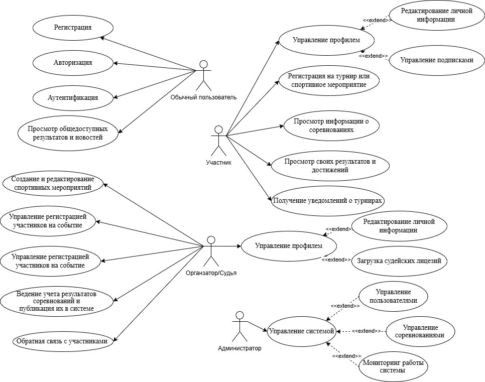

# Sports Tournament Management System - Дипломный проект Павлюткин П.С. 153501

Программное средство для организации и проведения спортивных мероприятий и турниров. Реализовано с использованием Spring Boot (бэкенд), PostgreSQL (БД), React (фронтенд) и Firebase Hosting (деплой фронтенда - планируется).

## 📌 Цель проекта

Создание платформы, которая позволит:
- Регистрацию/авторизацию пользователей и создание/редактирование профиля.
- Проведение турниров(различных видов) с возможностью регистрации команд.
- Отслеживание результатов соревнований и сбор статистики(лучшие игроки, больше всего побед, голов и т.п.).
- Ведение роли организаторов, игроков, судей и администраторов.

## 📷 Use-Case диаграмма

Диаграмма вариантов использования доступна по изображению ниже:



## ✅ Статус реализации функциональности

| Роль               | Функция                                                       | Статус         |
|--------------------|----------------------------------------------------------------|----------------|
| Обычный пользователь | Регистрация                                                    | ✅ Реализовано |
|                    | Авторизация                                                    | ✅ Реализовано |
|                    | Аутентификация                                                 | ✅ Реализовано |
|                    | Просмотр общедоступных результатов и новостей                 | ✅ Реализовано |
| Участник           | Управление профилем                                            | ✅ Реализовано |
|                    | ⤷ Редактирование личной информации                            | ✅ Реализовано |
|                    | ⤷ Управление подписками                                       | 🚧 В разработке |
|                    | Регистрация на турнир или спортивное мероприятие              | ✅ Реализовано |
|                    | Просмотр информации о соревнованиях                           | ✅ Реализовано |
|                    | Просмотр своих результатов и достижений                       | ✅ Реализовано |
|                    | Получение уведомлений о турнирах                              | 🚧 В разработке |
| Организатор/Судья  | Создание и редактирование спортивных мероприятий              | ✅ Реализовано |
|                    | Управление регистрацией участников на событие                 | ✅ Реализовано |
|                    | Ведение учёта результатов соревнований                        | 🚧 В разработке |
|                    | Публикация результатов в системе                              | 🚧 В разработке |
|                    | Обратная связь с участниками                                   | ❌ Не реализовано |
|                    | Управление профилем                                            | ✅ Реализовано |
|                    | ⤷ Редактирование личной информации                            | ✅ Реализовано |
|                    | ⤷ Загрузка судейских лицензий                                 | ❌ Не реализовано |
| Администратор      | Управление системой                                            | ✅ Реализовано |
|                    | ⤷ Управление пользователями                                   | ✅ Реализовано(на бэке) |
|                    | ⤷ Управление соревнованиями                                   | ✅ Реализовано(на бэке) |
|                    | Мониторинг работы системы                                     | 🚧 В разработке |

---

## 🛠️ Как запустить проект

### Серверная часть

1. Установите JDK 17.
2. Настройте PostgreSQL и создайте базу данных.
3. В `application.properties` укажите:
    ```
    spring.datasource.url=jdbc:postgresql://localhost:5432/tournament_db
    spring.datasource.username=your_user
    spring.datasource.password=your_password
    ```
4. Запустите проект командой:
    ```bash
    mvn spring-boot:run
    ```

### Клиентская часть

1. Установите Node.js.
2. В директории `frontend` выполните:
    ```bash
    npm install
    npm start
    ```

### Деплой(планируется)

- Клиентская часть развёрнута на Firebase Hosting.
- Сервер можно развернуть с помощью Docker или на любом сервере с поддержкой Java.

---

## 📬 Обратная связь
Если вы нашли ошибку или у вас есть предложения — отпишите пожалуйста pashanpmrp200431@gmail.com

